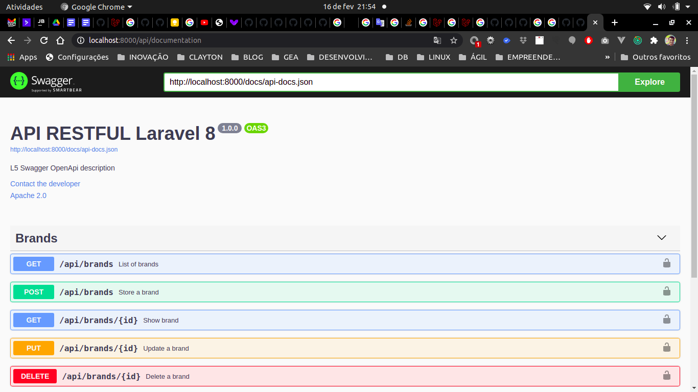
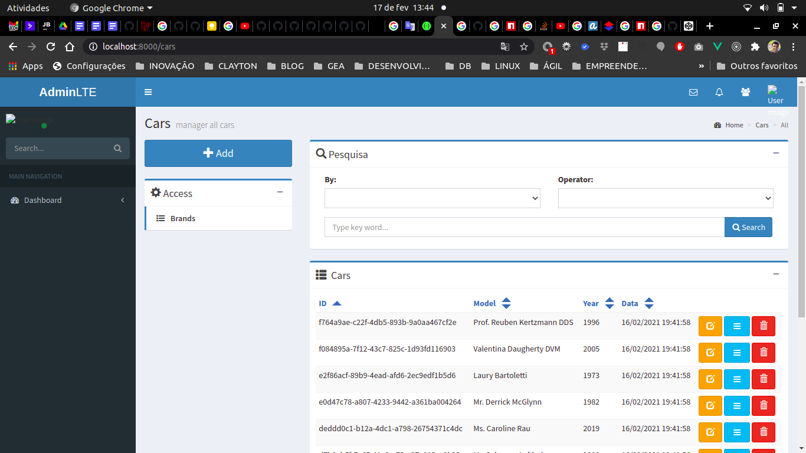

# Laravel 8 API Cars


### 1.	Third party package

> Laravel IDE Helper Generator: https://github.com/barryvdh/laravel-ide-helper

> Laravel Dump Server: https://github.com/beyondcode/laravel-dump-server

> Laravel 5 Repositories: https://github.com/andersao/l5-repository

> Doctrine DBAL: https://github.com/doctrine/dbal

> CORS Middleware for Laravel: https://github.com/fruitcake/laravel-cors

> Dingo API: https://github.com/dingo/api

> League Fractal: https://fractal.thephpleague.com/installation/

> Laravel Dusk: https://laravel.com/docs/8.x/dusk

> L5 Swagger: https://github.com/DarkaOnLine/L5-Swagger

> Behat-Laravel-Extension: https://github.com/laracasts/Behat-Laravel-Extension

### 2.  	Configuring environment using Docker
Run the command bellow on Bash:

```
$  sudo docker-compose up -d
```  

After then, run the command bellow on Bash to access Workspace:
```
$  sudo docker exec -it cars-app bash
```  

Or, run the command bellow on Bash to access DB:
```
$  sudo docker exec -it cars-db bash
```  
> API documentation: http://localhost:8000/api/documentation

### 3.  	Tests

##### 3.1  	Test using Seed
Run the command bellow on Bash:

```
$  php artisan migrate:refresh --seed
```  

##### 3.1  	Unit Tests
Run the command bellow on Bash:

```
$  vendor/bin/phpunit --filter BrandTest --testdox
$  vendor/bin/phpunit --filter CarTest --testdox
```  


##### 3.2  	Integration Tests
Run the command bellow on Bash:

```
$  vendor/bin/phpunit --filter BrandModelTest --testdox
$  vendor/bin/phpunit --filter CarModelTest --testdox
```  

##### 3.3  	Http Tests
Run the command bellow on Bash:

```
$  vendor/bin/phpunit --filter BrandControllerTest --testdox
$  vendor/bin/phpunit --filter CarControllerTest --testdox
```  

# SPA VUE 2


### 4.	Third party package
> Vue2 AdminLTE:  https://vuejsadmin.com/product/vue2-admin-lte

### 5.  	Build SPA

##### 5.1  	install dependencies 
Run the command bellow on Bash:

```
$  npm install
```  
##### 5.2  	Run dev mode
Run the command bellow on Bash:

```
$  npm run dev
```  
> SPA Car: http://localhost:8000/cars

### 6.  	Tests

##### 6.1  	Behavior test
Run the command bellow on Bash:

```
$  php artisan dusk --filter CarBrowserTest --testdox
```  

